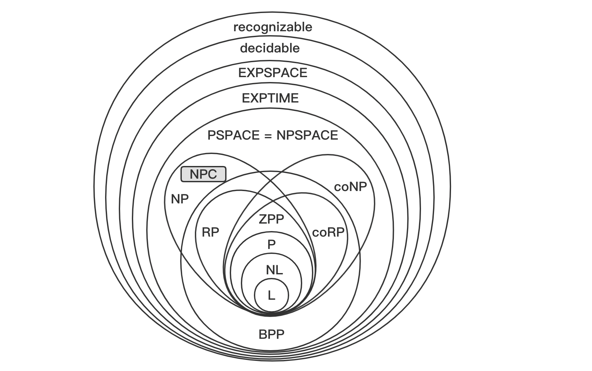

NOM:

## Calculabilité - complexité

### 0h45, sans document sauf une feuille A4, 22 avril 2022

---

Toutes les questions ont le même poids. Les réponses doivent être inscrites à la suite de chacune des questions, dans le cadre prévu à cet effet. Dans le cas (exceptionnel), où vous estimeriez qu'une question nécessite un développement plus important, utilisez une feuille séparée, en précisant le numéro de la question.

----

#### 1. Calculablité

##### 1. Comparer l'expressivité de $TLA^+$ et du langage C

- $TLA^+$ est plus expressif que C car il contient des théories mathématiques évoluées (théorie des nombres, théorie des ensembles) non présentes dans C.
- C est un langage de programmation donc plus expressif que $TLA^+$ qui est un langage de spécification.
- ✅ Ils sont équivalents car Turing-complets tous les deux.
- $TLA^+$ est Turing-parfait, mais pas C.
- On ne sait pas, personne n'a envisagé de comparer les deux.

##### 2. On considère le castor affairé (*busy beaver*) à 10 états. Lesquelles des propositions suivantes sont vraies (plusieurs choix possibles)

- Il existe un castor affairé à 9 états qui fait plus de transitions que lui.
- L'exécution du castor affairé prendrait plusieurs millénaires sur un ordinateur actuel.
- Il peut parfois écrire plus de 1 qu'il ne fait de transitions.
- On sait qu'il va s'arrêter un jour.
- Toute machine de Turing à 10 états qui s'arrête fait moins de transitions que ce castor affairé.
- Il ne sert à rien.

##### 3. Savoir si deux codes calculent la même chose est indécidable. Savoir si deux étudiants ont rendu le même projet est :

- Indécidable.
- ✅ Décidable pour un projet dans un langage de programmation, indécidable pour un langage de spécification de type $TLA^+$.
- Décidable dans tous les cas.

##### 4. Une machine de Turing universelle peut-elle simuler l'exécution d'une machine non détermiste? Justifier la réponse.

A universal Turing machine is a deterministic Turing machine that does not have the ability to simulate non-deterministic problems. We can introduce a non-deterministic Turing machine, which adds all possibilities to the state, making the running process non-deterministic

##### 5. Savoir si une machine de Turing a un nombre pair d'états est-il décidable ? Si oui, donner le principe de l'algorithme; si non, argumenter (montrer une réduction ou une contradiction).

There exists a small universal Turing machine: 2 states, 3 symbols, 6 transitions. and it is decidable

##### 6. Savoir si une machine de Turing avec un argument a s'arrête en moins de $t$ transitions est-il décidable? Si oui, donner le principe de l'algorithme; si non, argumenter (montrer une réduction ou une contradiction).

##### 7. Savoir si une machine de Turing avec un argument $a$, si elle s'arrête, a effectué un nombre pair de transitions est-il décidable?

##### 8. Étant donné une machine de Turing $\mathcal{M}$ sur l'alphabet $\{0,1\}$, savoir si l'exécution de $\mathcal{M}$ sur un ruban initialement vide écrit (au moins une fois) deux 1 consécutifs sur le ruban est-il décidable? Si oui, donner le principe de l'algorithme, sinon argumenter.

##### 9. Existe-t-il des fonctions récursives primitives dont on ne peut pas prouver qu'elles terminent, ou est-on toujours sûr qu'elles finiront par donner un résultat ? Justifier la réponse. (和第10题类似，关于递归函数的停机问题)

Primitive recursive functions can be computed with a Turing machine that always stops. They are completely computable functions

##### 10. Existe-t-il des fonctions récursives dont on ne peut pas prouver qu'elles terminent, ou est-on toujours sûr qu'elles finiront par donner un résultat ? Justifier la réponse.

Recursion includes primitive recursion and non-primitive recursion.

Primitive recursive functions can be computed with a Turing machine that always stops, whereas non-primitive recursive functions (like *Ackermann function*) require Turing-complete.

#### 2. Complexité

##### 11. La complexité d'un problème dans $P$ dépend du langage de programmation utilisé pour le résoudre.

- Oui, c'est pour cela que nous disposons de multiples langages de programmation, chacun étant plus efficace sur certains types de problèmes.
- Oui sauf si le problème est aussi dans $\mathbf{PSPACE}$.
- ✅ Non, tous les modèles de calcul sont équivalents pour $\mathbf{P}$.
- Ça dépend si le problème est dans $\mathbf{NP}$ ou pas.

##### 12. Donner l'intuition qui justifie que l'opinion générale pense que $P \subsetneq NP$.

Intuitively, computing a solution to a complex problem is simpler than verifying that a solution is correct.
If $P=NP$, then all passwords will become meaningless, and all problems with graphs will be solved easily

##### 13. Quelles propriétés doit satisfaire la classe des calculs "efficaces" en temps?

We generally believe that when the complexity is polynomial time, we consider it to be an efficient computation. Complexity class $\mathcal{P}$ problem:

- Closed class by addition, multiplication and composition: solving a problem by aggregating other problems preserves efficiency. The polynomials do not grow too fast.
- The calculation model is irrelevant: all equivalent up to a polynomial
- The representation of the data is irrelevant.

##### 14. Est-il vrai que, comme SAT est $NP$-complet, tout problème de décision peut être résolu en le réduisant à SAT et en utilisant un solveur SAT?

Because the **SAT** problem belongs to the $\mathcal{NP}-compelet$ class, in theory, if a problem $Q$ can be reduced to a **SAT** problem, i.g.
$$
Q \le_{p} SAT
$$
Then it means that the problem $Q$ can be solved "quickly" by **SAT** solver.

In addition, the problem classes of different complexity have the following relationship，
$$
\mathcal{P} \; \subseteq \; \mathcal{NP} \; \subseteq \; \mathsf{EXPTIME} \; \subseteq \; \mathsf{NEXPTIME}
$$
However, not all problems belong to the class of  $\mathcal{NP}$ .

##### 15. Comment est définie la complexité en espace d'un algorithme ?

Space complexity is a measure of the size of the storage space temporarily occupied by an algorithm during its operation. The so-called temporary storage space refers to the "space occupied by auxiliary variables" in the code, which includes "formal parameter variables" in the parameter table. The allocated storage space and the storage space allocated for the "local variables" defined in the function body are two parts. We define it by $S(n)=O(f(n))$, where n is the size of the problem.

##### 16. Quelle est la différence entre l'espace et le temps en tant que ressources à mesurer ?

The time complexity shows the "order of magnitude increase with the input size" of the program execution time, and to a large extent can well reflect the advantages and disadvantages of the algorithm.

Space complexity is a measure of the amount of storage space temporarily occupied by an algorithm during its operation.

When writing code, space can be exchanged for time, such as dictionary trees, hashes, etc.

##### 17. Pourquoi peut-on parler de la classe $\mathsf{LSPACE}$ (espace logarithmique) alors que ça n'a pas de sens de parler d'une classe $\mathsf{L}$ (temps logarithmique)?

Turing machines operating in logarithmic time cannot even read the entire input. This makes them rather uninteresting.

In the Turing machine model, the "logarithmic space" corresponds to the size of a working tape **additionally** to the input tape.

##### 18. Existe-il des problèmes dans $\mathcal{P}$ qui nécessitent un nombre exponentiel de cases?

Complexity class $P$ problem is a problem that can be determined in polynomial time, exponential time complexity does not belong to it.
$$
\mathcal{P} \subsetneq \mathsf{EXPTIME}
$$

##### 19. Existe-t-il des problèmes $\mathsf{PSPACE}-\text{complets}$ qui ne soient pas aussi $\mathcal{NP}-\text{complet}$?

There is a relatively simple inclusion relationship between these classic complexity classes: 
$$
1SPACE \; ⊆ \; LSPACE \; ⊆ \; NLSPACE \;⊆\; P \;⊆\; NP \\
\;⊆\; PSPACE \;⊆\; EXPTIME \;⊆\; EXPSPACE
$$
 We generally think that $\mathsf{PSPACE} \ne \mathcal{NP}$ , in this case $\mathsf{PSPACE}-\text{complets} \ne \mathcal{NP}-\text{complet}$. Furthermore, $\mathcal{NP} \;⊆\; \mathsf{PSPACE}$. Therefore, we believe that there is a problem as stated in the title.

##### 20. Un problème soluble en temps probabiliste polynomial (dans $RP$) peut ne pas avoir de solution déterministe polynomiale (pas dans $P$).

- Oui, c'est l'apport des tirages aléatoires.
- Non, on peut simuler un tirage aléatoire en visitant les deux cas.
- On ne sait pas mais on soupçonne que les deux classes sont égales.
- C'est l'inverse, il y a des problèmes solubles déterministiquement en temps polynomial et qui n'ont pas de solution polynomiale avec des tirages aléatoires car ceux-ci peuvent mener l'algorithme dans une mauvaise branche du calcul.