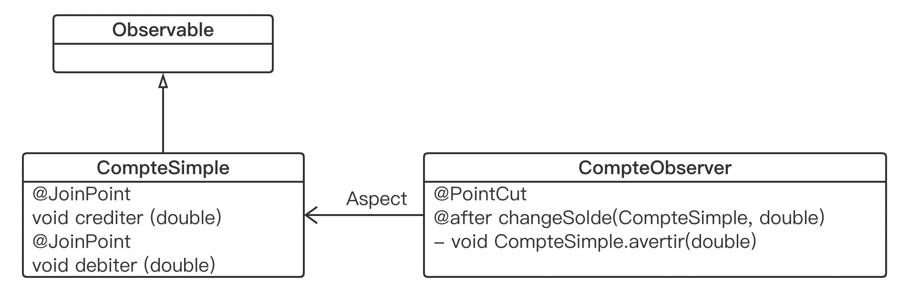

Session 1, 2021

## Paradigmes Émergents de la Programmation Programmation Avancée

### Examen, 45', Feuille A4 autorisée (à rendre)

#### Exercice 1 

Considérons le code du listing 1:

```java
// Listing 1: Code
import java.io.*;
class Moyenne {
  public double valeur () throws FileNotFoundException, I0Exception (
	int nb = 0:
	double somme = 0:
	try (BufferedReader in = new BufferedReader(new FileReader ("exemplel.txt"))) {
    String ligne = null;
    while ((ligne = in. readLine()) != nulL) {
      String[] morceaux = ligne.split(" ");
      nb++;
      somme += Double. parseDouble (morceaux[1]);
    }
    return somme / nb;
  }

	public static void main(String[] args) throws Exception {
		System.out.println(new Moyenne().valeur()) ;
	}
}
```

1. Que fait ce programme ? On donnera un exemple de contenu pour le fichier `exemple.txt`.

   > This program converts the second string of each line in the file  `exemple.txt` to a double and returns their average.
   >
   > ```
   > xxx 1 xxx xxx xxx ...
   > xxx 2 xxx xxx xxx ...
   > ```

2. Indiquer ses limites et les évolutions qu'il serait souhaitable de lui apporter.

   > This program has high coupling and is not easy to maintain. We can combine Proxy mode and IoC to optimize this program

#### Exercice2: `checkedList`

La classe utilitaire `Collections` définit la méthode `checkedList` qui s'utilise de la manière suivante (en considérant que `maListe` et `autre` sont déclarées du même type `List`):

```java
...
autre = Collections.checkedList (maListe, Point.class);
...
```

Le deuxième paramètre est le type attendu pour les éléments de la liste. Les méthodes qui ajoutent ou remplacent un élément de la liste lèvent l'exception `ClassCastException` si le nouvel élément n'est pas compatible avec le type attendu.

Il existe une telle méthode pour chaque structure de données : `checkedSet`, `checkedMap`...

1. Quel est le patron de conception utilisé pour implanter de telles méthodes ? On donnera le diagramme de classe qui correspond à ce patron et on utilisera du pseudo-code pour en expliquer le comportement.

   > 详见 `2020年 - 1.*`

2. L'introspection pourrait être utilisée pour implanter ces différentes méthodes du *framework* des collections. Expliquer comment ceci serait fait en Java.

3. Les implantations de ces méthodes dans le *framework* des collections n'utilisent pas l'introspection. Quelles raisons peut-on avancer ?

#### Exercice 3 

On considère le code du listing 2:

```java
// Listing 2: Code
import java.util.Observable;

public aspect CompteObserver (
	declare parents : CompteSimple extends Observable;
  
	private void CompteSimple.avertir(double montant) {
    this.setChanged();
		this.notifyObservers(montant);
  }
  
	pointcut changeSolde (CompteSimple cs, double m) :
		target(cs)
		&& args (m)
		&& (call (void CompteSimple.crediter (double))
				|| call (void CompteSimple.debiter (double)));
  
  after (CompteSimple cs, double montant) : changeSolde(cs, montant) {
    String methodName = thisJoinPoint.getSignature().getName();
    int facteur = (methodName. equals ("debiter")) ? -1 : 1;
    cs.avertir(facteur * montant);
    System.out.println("Notification sur " + cs);
  }
}
```

1. Quel est le langage utilisé ?

   > This language is `AspectJ` which is based on `Java`

2. Expliquer les éléments qui apparaissent sur ce listing.

   > 详见 `2020年 - 4.1`

3. Dessiner le diagramme de classe de l'application qui s'exécutera.



#### Exercice 4

Les langages Java et Python proposent la notation `@xxx.`

1. Expliquer l'objectif de cette notation.

   > In python, `@xxx` means <u>decorator</u>. A decorator is a function that takes a function (the decorated function) as a parameter and returns a function. It can add other functions to the function without changing the original function.

2. Donner au moins un exemple de cette notation pour chaque langage, Java et Python.

   > Java: `@Override, @Servlet, @Test, ...`
   >
   > Python: `@nameOfDecorator`

3. Comparer la mise en œvre de cette notation dans les langages Java et Python.

   >Python:
   >
   >```python
   >def decorator(decoratedFunc):
   >  def wrapper(*args, **kwargs):
   >    print('TODO before executing the decoratedFunc')
   >    decoratedFunc(*args, **kwargs)
   >    print('TODO after executing the decoratedFunc')
   >  return wrapper
   >
   >@decorator
   >def func_muilt(*args,**kwargs):
   >  print('this is func_muilt')
   >  
   >func_muilt('python', y1='decorator')
   >```
   >
   >Java: `Annotation` is a kind of metadata used to describe the code, which can be understood as a comment to the machine. It can mainly be used to generate javadoc documents, help code analysis during reflection, and perform basic checks at compile time.
   >
   >```java
   >public class Animal{
   >  public void eat(){
   >    System.out.println("Eating...");
   >  }
   >}
   >public class Dog extends Animal{
   >  @Override
   >  public void eat(){
   >    System.out.println("Dogs are eating...");
   >  }
   >}
   >```
   >
   >
   >
   >