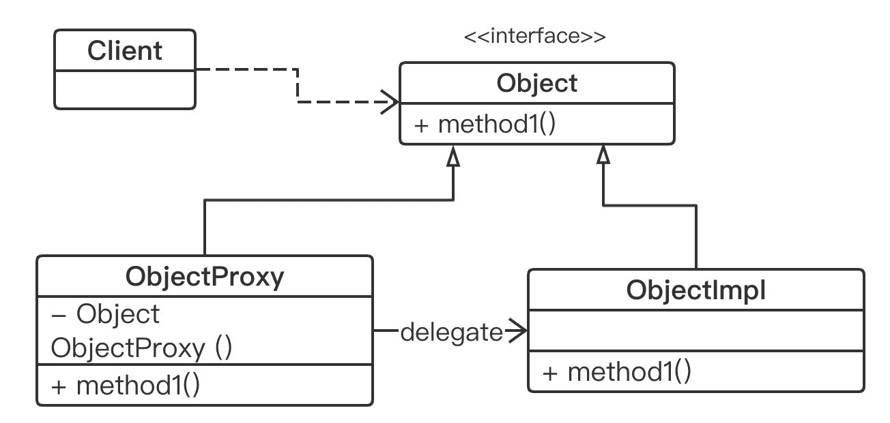

### Examen_2020  Programmation Avancée

#### Exercice 1

1. The design pattern we have used here is `Dynamic Proxy`.

   We take the static proxy as an example to draw the following class diagram：

   

   

2. Implementing a proxy only requires calling the `newProxyInstance()`:

   ```java
   // 生成一个目标函数的代理对象
     // 1. ClassLoader loader : 指定当前目标对象使用的类加载器 Specifies the class loader used by the current target object
     // 2. Class<?>[] interface : 目标对象实现的接口类型，使用泛型方法确认类型 The interface type implemented by the target object, use the generic method to confirm the type
     // 3. InvocationHandler handler : 事件处理，执行目标对象的方法时，会触发事件处理器方法 Event processing, when the method of the target object is executed, the event handler method will be triggered
   static Object newProxyInstance(ClassLoader loader,
                                 Class<?>[] interfaces, // 传入目标对象
                                 InvocationHandler handler);
   ```

   ```java
   List<Integer> nonModifiable = (List<Integer>)
   			Proxy.newProxyInstance(List.class.getClassLoader(),
   					new Class[] { List.class }，
             // 在这里写功能增强的函数 Handler
   					new ProtectionHandler(nombres, "add", "remove", "clear"));
   public ProtectionHandler(Object recepteur, String... methodesInterdites) {
   		this.recepteur = recepteur;
   		this.methodesInterdites = new TreeSet<>();
   		Collections.addAll(this.methodesInterdites, methodesInterdites);
   	}
   public Object invoke(Object proxy, Method method, Object[] args) throws Throwable {
   	if (methodesInterdites.contains(method.getName())) {
   		throw new UnsupportedOperationException();
   	}
   	return method.invoke(this.recepteur, args);
   }
   ```

3. `Reflection` is in the running state. For any class, we can know all the properties and methods of this class; for any object, we can call any method of it.

   `Introspection` operates the properties of JavaBean through reflection, and obtains the `getter/setter ` method corresponding to a property. The general practice is to obtain the BeanInfo information of an object through the class Introspector, and then obtain the property descriptor (PropertyDescriptor) through BeanInfo, through which the getter/setter method corresponding to a property can be obtained.

#### Exercice 2

1. In python, `@xxx` means <u>decorator</u>. A decorator is a function that takes a function (the decorated function) as a parameter and returns a function. It can add other functions to the function without changing the original function.

2. We can give a decorator's mechanism as an example:

   ```python
   def decorator(decoratedFunc):
     def wrapper(*args, **kwargs):
       print('TODO before executing the decoratedFunc')
       decoratedFunc(*args, **kwargs)
       print('TODO after executing the decoratedFunc')
     return wrapper
   ```

3. In java, `@xxx` is an <u>annotation</u>. It can annotate classes, methods, variables, parameters and packages of the Java language. At compile or run time, the annotation annotates the processing of the content information


#### Exercice 3

**IoC**(Inversion of Control) is a design principle in OOP to reduce the coupling between the code. The basic idea is to achieve decoupling between objects with dependencies with the help of a "third party". We can implement Inversion of Control using Dependency Injection

Take the most common "spring framework" as an example:

- The *beanFactory* is contrainer in "spring" as the "third party" we mentioned above, which stores instances (beans) not created by us, and creates objects through reflection when needed.
  We can use the annotation `@Component` to declare an instance (bean) in a beanFactory

```java
package fr.n7.gdai.spring
@Component("account")
public class Account{
  @Value("1")
	private Integer id;
  @Value("gdai")
	private String name;
  @Value("24")
  private Integer age;
  @Autowired
  private Order order;
}
```

```java
package fr.n7.gdai.spring
@Component("order")
public class Order{
  @Value("000001")
	private String orderID;
  @Value("1000.0")
	private float price;
}
```

```java
public class Test{
  public static void main(String[] args){
    ApplicationContext context = 
      new AnnotationConfigApplicationContext("fr.n7.gdai.spring.*");
    System.out.println(context.getBean("account"));
  }
}
```

```
Account(id=1, name=gdai, age=24, order=Order(orderID=000001, price=1000.0))
```


#### Exercice 4

1. Explain the meaning of the elements
   - `aspect`: The aspect keyword defines a class, which is an aspect. It is a combination of `pointcut` and `advice`
     - `declare-parents`: declare that matching types have a new parent (hence the name)
   - `Weaving`: The process of applying enhanced function code to a target object to create a new proxy object
   - `joinpoint`: Points that will be "intercepted" in the original method
   - `pointcut`: is the definition of those methods that need to be "enhanced". `pointcut` is the method that need to apply an aspect, generally used for authorization verification or logging
     - `target`: create an aspect for that class (target)
     - `call`: the methods who need to be "enhanced"
   - `Advice`: is what needs to be done after the joinpoint is intercepted (the way how to enhance that method)
     - `before-returning`: enhance (`Advice`) before method (`pointcut`)
     - `after-returning`: enhance (`Advice`) after method (`pointcut`)
     - `around`: `before` + `after`
     - `after-throwing`: Throws an exception when an exception occurs in the target method
     - `after`: will eventually be executed
2. 
1. advantage: Better meet the requirements of "high cohesion, low coupling" in OOP thinking
   
   disadvantage: Need to import AspectJ's compiler/weaver, which is more complex